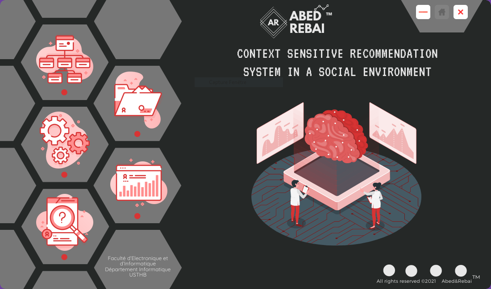

# Context-sensitive-recommendation-system-in-a-social-environment
Recommendation systems aim to automatically suggest to users items that are related to their interests. These tools are increasingly present on content platforms, but literature reviews point out the absence of context aware recommender systems in social networks. Therefore, we focus in this work on this issue and we propose a hybrid recommendation approach in social networking context, using Deep Learning (DL) techniques and taking into account contextual information according to an architecture based on the following two models (1) HybMLP (Hybrid Multi-Layer Perceptron - HybMLP ) which is the hybridization of collaborative and content-based filtering algorithms, and (2) SocHybMLP (Social Hybrid MultiLayer Perceptron - HybMLP) which takes into account the use of social information. The experiments results conducted on three different datasets demonstrated the added value of using social and contextual information.
+ Screenshots of our graphical interface devlopped with java:
  + Main Menu :
  
